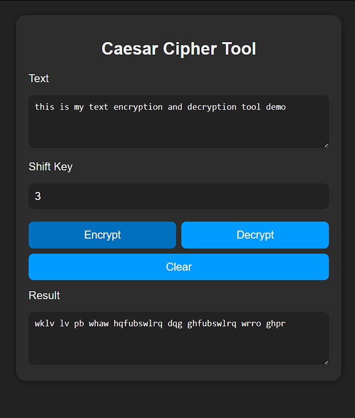

# Text Encryption & Decryption Tool

A simple web-based Caesar cipher encryptor/decryptor. Enter text and a shift key to encrypt or decrypt messages.

## Features

- Caesar cipher encryption and decryption
- User-friendly web interface
- Clean CSS styling

## How to Use

1. Enter your text.
2. Choose a shift key (number).
3. Click **Encrypt** or **Decrypt** to see the result.

## Screenshot

## License

MIT
